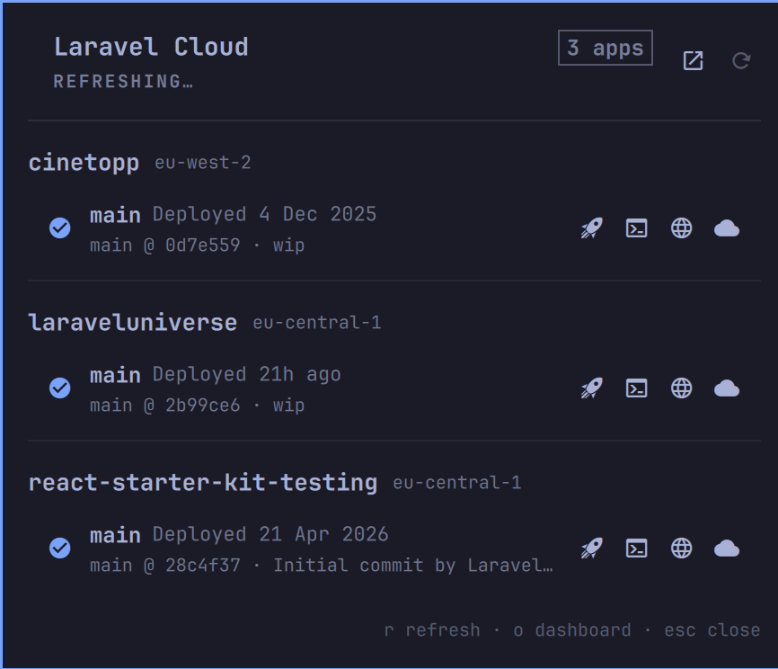

# Laravel Cloud for Omarchy

A bar widget for the [Omarchy](https://omarchy.org) shell that shows your
[Laravel Cloud](https://cloud.laravel.com) applications, their environments and
the latest deployment of each, and lets you deploy from the bar.

Everything goes through the official [`cloud` CLI](https://github.com/laravel/cloud-cli).
The widget never talks to the Laravel Cloud API itself and never stores
credentials of its own.



## Requirements

- Omarchy 4 (the shell plugin system; Omarchy 3.x is not supported)
- PHP 8.2+ and [Composer](https://getcomposer.org)
- The Laravel Cloud CLI: `composer global require laravel/cloud-cli`
- `jq`, `git`, `notify-send` and `xdg-open` (all part of a stock Omarchy install)

## Install

```bash
omarchy plugin add https://github.com/christophrumpel/omarchy-laravel-cloud.git --enable
```

Omarchy clones the repo into `~/.config/omarchy/plugins/christophrumpel.laravel-cloud/`,
asks which bar section to use, and enables the widget. If the `cloud` CLI is
missing or you are not signed in yet, the panel shows a button that takes
care of it (see below).

To update or remove:

```bash
omarchy plugin update christophrumpel.laravel-cloud
omarchy plugin remove christophrumpel.laravel-cloud
```

Removing the plugin does not touch the CLI or its tokens. The widget's own
cache lives in `~/.local/state/omarchy/laravel-cloud/` and can be deleted
freely.

## Authentication

The widget reuses whatever the `cloud` CLI is signed in with. There are two
ways to sign in:

1. **Browser sign-in (recommended).** Click *Sign in to Laravel Cloud* in the
   panel, or run `cloud auth` in a terminal. The CLI opens your browser and
   stores an API token per organization in `~/.config/cloud/config.json`.
   If you belong to several organizations, the widget shows the apps of all
   of them.
2. **Token from the environment.** Create a token in the Laravel Cloud
   dashboard and export it as `LARAVEL_CLOUD_TOKEN` in the environment that
   starts `omarchy-shell` (for example via Hyprland's `env` config). The
   widget then uses only that organization. Alternatively save it once with
   `cloud auth:token --add --token=<token>`.

The widget only ever passes tokens to the `cloud` CLI through the
`LARAVEL_CLOUD_TOKEN` environment variable the CLI documents. Tokens are not
written to the widget's cache or logs.

## Bar icon

| Click  | Action                                  |
|--------|-----------------------------------------|
| left   | open / close the panel                  |
| right  | open cloud.laravel.com                  |
| middle | refresh now                             |

The icon spins while a deployment is running and switches to the urgent
colour when the latest deployment of any environment failed.

## Panel

Every application is listed with its environments. Per environment you see the
status, the latest deployment (time, branch, commit) and four actions:

- **Rocket: deploy.** Click once to arm (*Deploy?*), click again to confirm.
  Runs `cloud deploy <app> <env>` detached from the shell, sends a desktop
  notification when it finishes and refreshes the widget.
- **Terminal:** `cloud deploy:monitor <app> <env>` in a floating terminal.
- **Globe:** open the environment URL.
- **Cloud:** open the environment in the Laravel Cloud dashboard.

Keys: `r` refresh, `o` dashboard, `Esc` close, `Tab` next panel.

## Settings

```bash
omarchy bar set christophrumpel.laravel-cloud <key> <value>
```

| Key                  | Default | Meaning                                                   |
|----------------------|---------|-----------------------------------------------------------|
| `refreshIntervalSec` | `300`   | Background refresh interval                               |
| `deployPollSec`      | `10`    | Poll interval while a deployment is running               |
| `cloudBin`           | empty   | Explicit path to the `cloud` binary; auto-detected if empty (`PATH`, then Composer's global `vendor/bin`) |

## What the plugin does on your system

Omarchy plugins run unsandboxed inside `omarchy-shell`, so here is the full
list of what this one touches:

- **Runs** the `cloud` CLI (`application:list`, `deployment:list`, `deploy`,
  `deploy:monitor`, and `auth` when you click *Sign in*). The CLI talks to
  the Laravel Cloud API over HTTPS. Nothing else on the network is contacted.
- **Runs** `composer global require laravel/cloud-cli` only when you click
  *Install cloud CLI* in the panel. Nothing is installed automatically.
- **Reads** `~/.config/cloud/config.json` to know whether you are signed in
  and to hand the right organization's token to the CLI.
- **Writes** only to `~/.local/state/omarchy/laravel-cloud/`: the status
  cache (`status.json`, no secrets), deploy logs, and one tiny Git
  repository per app under `repos/`. The CLI refuses to deploy from a
  directory without a Git remote, so each stub has your app's repository set
  as `origin`. Nothing is ever fetched, committed or pushed there.
- **Sends** desktop notifications via `notify-send` and opens URLs via
  `xdg-open`.
- **Does not** use `sudo`, modify your Omarchy or Hyprland configuration, or
  bundle binaries. It is a handful of Bash scripts plus QML.

Deploying is a real action against your production infrastructure. The
two-click arm/confirm on the rocket button is the only safeguard.

## Files

- `BarWidget.qml` / `Panel.qml`: the bar button and the popup.
- `bin/laravel-cloud-status`: builds the JSON snapshot (`--cached` reads the last one).
- `bin/laravel-cloud-deploy`: deploy, wait, notify, refresh.
- `bin/laravel-cloud-monitor`: `cloud deploy:monitor` for the terminal button.
- `bin/laravel-cloud-setup`: `auth` and `install` steps for the panel buttons.
- `bin/laravel-cloud-lib`: shared helpers.

## IPC

```bash
omarchy-shell christophrumpel.laravel-cloud open|close|toggle|refresh|dashboard
```

## Development

```bash
omarchy plugin validate .
```

Saving any file under `~/.config/omarchy/plugins/` hot-reloads the plugin.

## License

MIT. See [LICENSE](LICENSE).
